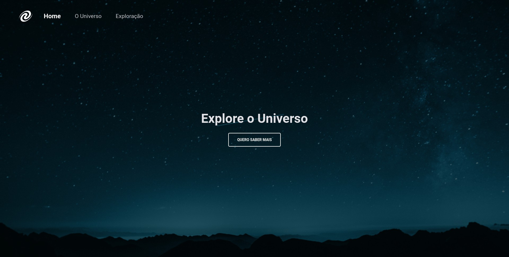
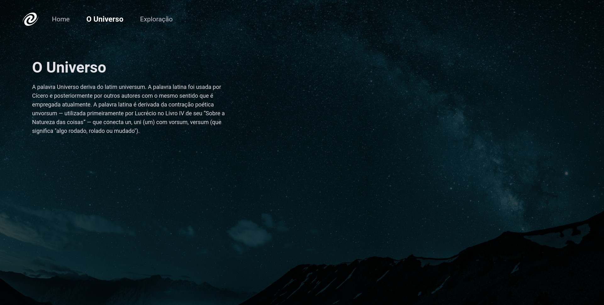
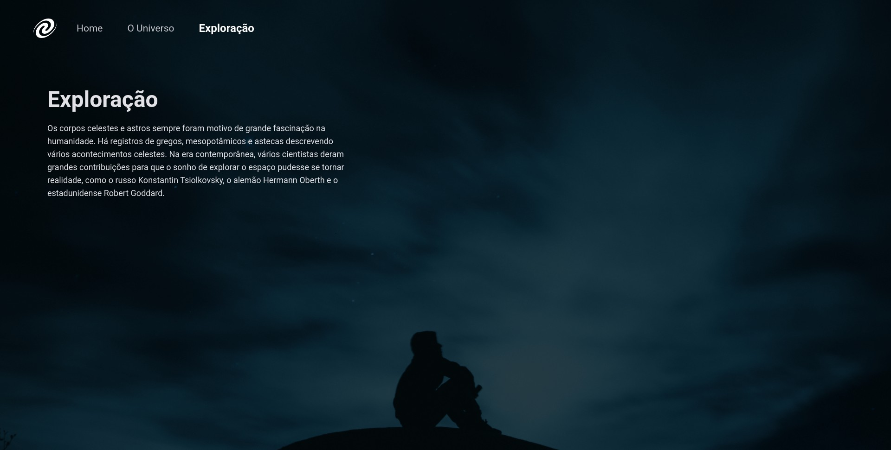

  Desafio realizado dentro do Explorer 
  <a href="https://www.rocketseat.com.br/explorer">Estude esse projeto em formato de vídeo clicando aqui.</a>

  <a href="#-tecnologias">Tecnologias</a>&nbsp;&nbsp;&nbsp;|&nbsp;&nbsp;&nbsp;
  <a href="#memo-licença">Licença</a>

  

 

  
  
  

## 🚀 Tecnologias

Esse projeto foi desenvolvido com as seguintes tecnologias:

- HTML, CSS e JavaScript
- Git e Github
- Figma

## 💻 Projeto

O projeto em questão teve como objetivo principal a criação de uma Single Page Application (SPA) utilizando as tecnologias fundamentais da web: HTML, CSS e JavaScript. A ênfase foi no aprendizado dos conceitos de SPA, orientação a objetos em JavaScript, uso do fetch() para requisições assíncronas de dados, manipulação de promessas com .then(), além da aplicação de arrow functions e outras técnicas modernas.

## :memo: Licença

Esse projeto está sob a licença MIT.

---

Feito com ♥ by Rocketseat :wave: [Participe da nossa comunidade!](https://discord.gg/rocketseat)